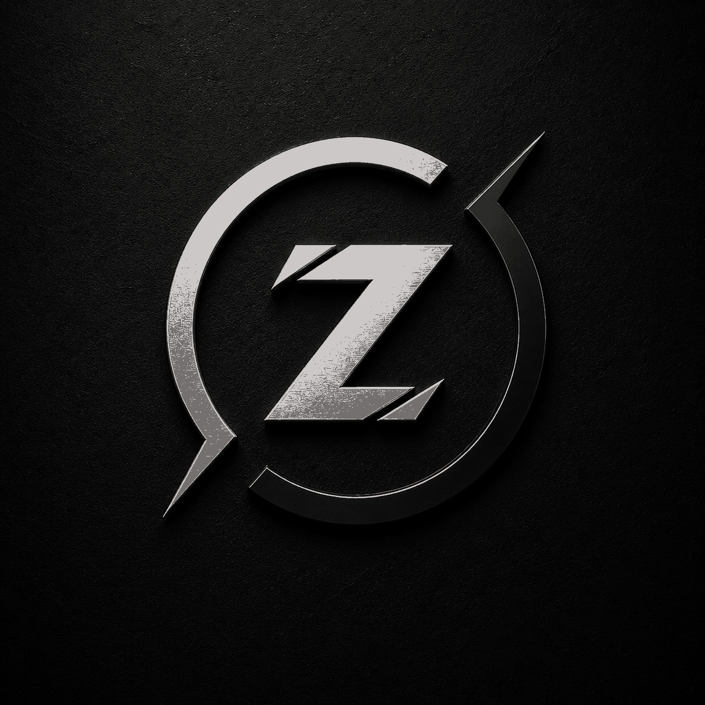
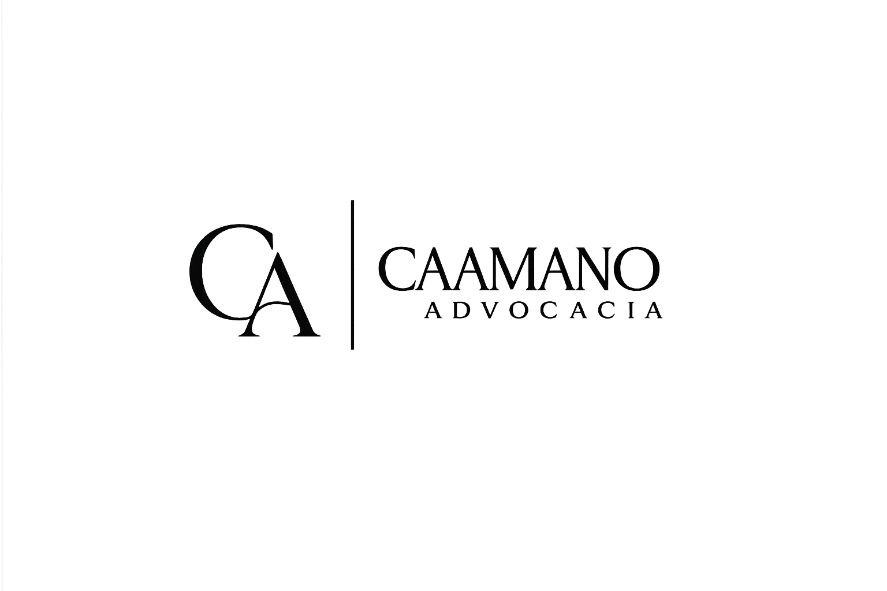
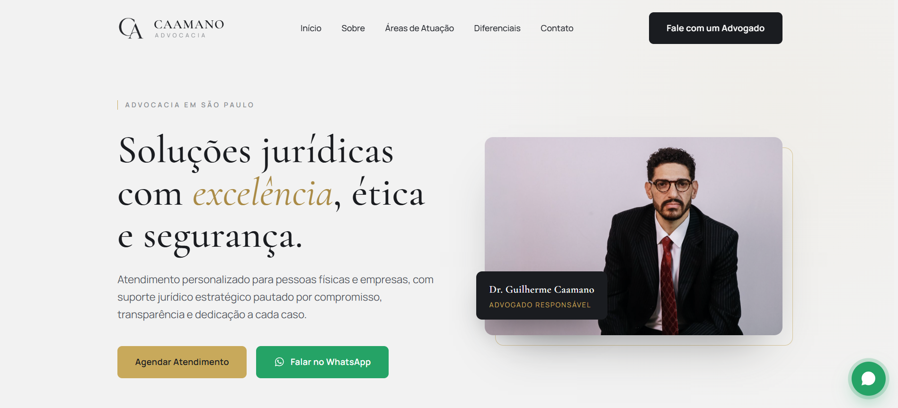

# ZHYON

### Criação de sites profissionais

Desenvolvemos sites modernos, responsivos e personalizados para empresas, marcas e profissionais que desejam fortalecer sua presença digital.

 

---

## Sobre a Zhyon

A **Zhyon** é especializada na criação de sites institucionais, landing pages e portfólios digitais.

Cada projeto é desenvolvido de acordo com a identidade visual, os objetivos e as necessidades do cliente, com atenção à organização, responsividade e experiência do usuário.

---

## Serviços

- Sites institucionais;
- Landing pages;
- Portfólios profissionais;
- Sites para empresas e profissionais autônomos;
- Redesign de sites;
- Manutenção e atualização;
- Integração com WhatsApp, formulários e redes sociais;
- Adaptação para computador, tablet e celular.

---

## Projeto em destaque

### Caamano Advocacia

Site institucional desenvolvido para a **Caamano Advocacia**, escritório localizado em São Paulo.

O projeto foi estruturado para apresentar o escritório, suas áreas de atuação, seus diferenciais e seus canais de atendimento de forma clara, moderna e profissional.

### Recursos do projeto

- Identidade visual personalizada;
- Layout responsivo;
- Apresentação institucional;
- Áreas de atuação;
- Seção de diferenciais;
- Formulário de contato;
- Integração com WhatsApp;
- Botões de chamada para atendimento;
- Navegação organizada;
- Adaptação para dispositivos móveis.

### Tecnologias utilizadas

- WordPress;
- Elementor.

---

## Tecnologias e ferramentas

---

## Contato

Precisa de um site profissional para sua empresa, marca ou projeto?

[%2092486--5710-111111?style=for-the-badge&logo=whatsapp&logoColor=white)](https://wa.me/5511924865710)

---

### ZHYON

**Criação de sites profissionais.**

© 2026 Zhyon. Todos os direitos reservados.

